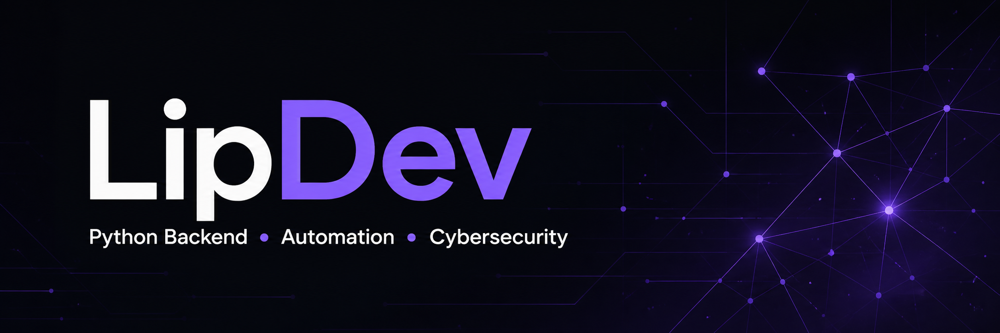

  

<h1 align="center">Hamilton Felipe</h1>
<h3 align="center">Aspiring Python Backend Developer · Cybersecurity Enthusiast</h3>

  Python automation · REST APIs · Flask · SQLite/MySQL · Git-based workflows

  Recife, Pernambuco, Brazil · Open to remote, hybrid, and on-site junior opportunities

  
  
  

---

<table>
  <tr>
    <td width="34%" align="center">
      
    </td>
    <td width="66%">
      <h2>Current direction</h2>
      
I am moving my public work toward <strong>Python backend development and automation</strong>. My hands-on practice includes building a Flask CRUD application with SQLite, consuming APIs with Requests, browser automation with Selenium, and command-line experiments.

      
I work daily in <strong>Parrot OS</strong> and am developing security-conscious habits through authorized labs. Offensive security is a learning path alongside backend engineering, not a claim of professional security experience.

      
I study <strong>Systems Analysis and Development</strong> at Centro Universitário Maurício de Nassau, with expected completion in March 2027.

    </td>
  </tr>
</table>

## Technologies

### Backend and data

  
  
  
  
  

### Automation and workflow

  
  
  
  

### Tools and quality

  
  
  
  
  

### Currently learning

  
  
  
  
  

---

## GitHub statistics

  

  

---

## About me

I am building a focused foundation in Python backend development: clear API design, persistent data, maintainable code, and useful automation. Flask is the framework with which I currently have the most hands-on practice. I have also worked with SQLite and MySQL, integrated external APIs with Requests, automated browser tasks with Selenium, and explored Docker and pytest through exercises.

My next step is to turn that practice into small public projects with documentation, validation, error handling, logging, and automated tests. At the same time, I am learning the fundamentals of web and API security so I can build software with safer defaults.

## Featured project

### Odin — Planning / Early Prototype

Odin is a terminal-oriented assistant planned to help inspect a supplied web application URL and organize potential security findings during **authorized testing**. The current prototype is **not functional** and does not yet perform reliable vulnerability detection. The project remains in planning while I define a safe scope, test cases, and a maintainable Python structure.

## Goals

- Publish a maintainable Python REST API.
- Add input validation, authentication, error handling, logging, documentation, and automated tests to a backend project.
- Publish a useful Python automation project.
- Progress through authorized offensive-security labs.
- Turn Odin from a plan into a safe, testable prototype.

---

  

<em>Starting small, learning deliberately, and documenting the progress.</em>

